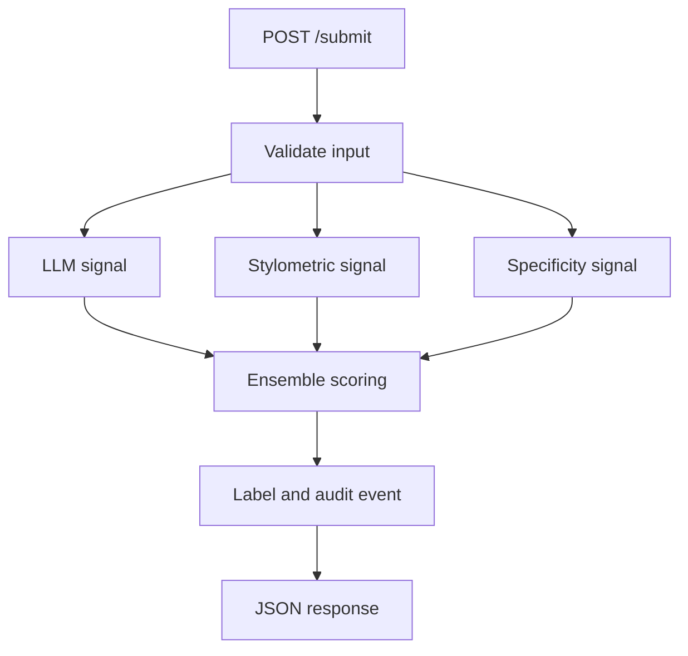

# Provenance Guard
Provenance Guard analyzes submitted text with three signals - an LLM classifier, stylometric features, and specificity heuristics and returns `likely_ai`, `likely_human`, or `uncertain`. It records the individual scores behind each result and gives creators a route to appeal the decision. 

# Demo

Submit a passage:

```bash
curl -X POST http://localhost:5050/submit \
  -H "Content-Type: application/json" \
  -d '{
    "text": "Artificial intelligence represents a transformative shift in modern society. It is important to note that its benefits should be weighed against its ethical implications.",
    "creator_id": "demo-user",
    "content_type": "essay"
  }'
```

The API returns the classification, scores contributed by each signal, and reasoning behind the certainity of its decision. 

```json
{
  "content_id": "89576397-a00f-455f-933d-1596885ef1ee",
  "attribution": "uncertain",
  "ai_likelihood": 0.7398,
  "confidence": 0.6617,
  "signal_agreement": 1.0,
  "signals": {
    "llm": { "score": 0.71, "reason": "Generic and highly regular phrasing." },
    "stylometry": { "score": 0.616, "metrics": {} },
    "specificity": { "score": 1.0, "metrics": {} }
  },
  "status": "classified"
}
```
The result remains `uncertain` because its AI-likelihood does not reach the `0.75` threshold.

# Key features

- **Three-signal ensemble:** combines holistic LLM judgment with inspectable, deterministic heuristics.
- **Separate likelihood and confidence:** distinguishes the direction of the evidence from the strength of the decision.
- **Explicit abstention:** returns `uncertain` when evidence is weak or mixed. 
- **Short-text dismissal:** does not call the LLM below 30 words and caps confidence at the neutral score. 
- **Explainable responses:** exposes signal scores, model reasoning, and underlying text metrics.
- **Appeals workflow:** allows creators to contest a result and marks the classification for human review.
- **Audit trail:** stores classification, appeal, and certificate events in SQLite.
- **Rate limiting:** protects model-backed and database-writing endpoints from basic abuse.
- **Operational visibility:** reports the configured model and LLM-signal status through the health endpoint.

## Tech stack

| Layer | Technology |
|---|---|
| API | Python, Flask |
| LLM inference | Groq API |
| Current Default model | `openai/gpt-oss-120b` |
| Storage | SQLite |
| Rate limiting | Flask-Limiter |
| Configuration | python-dotenv |
| Deterministic analysis | Python regular expressions and stylometric heuristics |
| Production server | Gunicorn |
| Testing | pytest, Ruff |

## Architecture



Each signal returns a score from `0.0` (more human-like) to `1.0` (more AI-like).

```python
ai_likelihood = (
    0.50 * llm_score
    + 0.30 * stylometry_score
    + 0.20 * specificity_score
)
```

`signal_agreement` is the proportion of signals on the same side of `0.5` as the combined result. A signal at exactly `0.5` is neutral which does not count as agreement. 

```python
distance_from_middle = abs(ai_likelihood - 0.5) * 2
confidence = (
    0.65 * distance_from_middle
    + 0.35 * signal_agreement
)
```
| Condition | Attribution |
|---|---|
| `ai_likelihood >= 0.75` and `confidence >= 0.65` | `likely_ai` |
| `ai_likelihood <= 0.25` and `confidence >= 0.65` | `likely_human` |
| Anything else | `uncertain` |

### First Calibration 

This seven-case calibration set is meant to expose failure modes and prevent regressions.

| Case | Words | LLM | Stylometry | Specificity | AI likelihood | Confidence | Result |
|---|---:|---:|---:|---:|---:|---:|---|
| AI-like formal | 71 | 0.82 | 0.5508 | 0.9061 | 0.7565 | 0.6834 | `likely_ai` |
| Casual human | 55 | 0.15 | 0.3638 | 0.0000 | 0.1841 | 0.7607 | `likely_human` |
| Formal human | 68 | 0.62 | 0.7393 | 0.5000 | 0.6318 | 0.4047 | `uncertain` |
| Edited hybrid | 71 | 0.15 | 0.4025 | 0.3122 | 0.2582 | 0.6643 | `uncertain` |
| Non-native formal | 61 | 0.15 | 0.7384 | 0.0628 | 0.3091 | 0.4815 | `uncertain` |
| Very short | 3 | 0.50* | 0.6800 | 0.3333 | 0.5207 | 0.1436 | `uncertain` |
| Poetic | 17 | 0.50* | 0.6813 | 0.1667 | 0.4877 | 0.1326 | `uncertain` |

\* The LLM was not called for samples under 30 words; the neutral fallback is `0.5`.

## Installation

```bash
git clone https://github.com/aayushalayla/provenance-guard.git
cd provenance-guard

python3 -m venv .venv
source .venv/bin/activate
pip install -r requirements.txt

cp .env.example .env
```

Add your API key to `.env`:

```dotenv
GROQ_API_KEY=your_api_key_here
GROQ_MODEL=openai/gpt-oss-120b
GROQ_TIMEOUT_SECONDS=20
PORT=5050
```

Start the development server:

```bash
python3 app.py
```

Or run the API with Gunicorn:

```bash
gunicorn --bind 0.0.0.0:5050 app:app
```

The application defaults to port `5000`; the example configuration uses `5050` because macOS AirPlay Receiver may occupy port 5000.


## Usage

| Method | Endpoint | Purpose |
|---|---|---|
| `GET` | `/` | Check service and LLM status |
| `POST` | `/submit` | Analyze submitted text |
| `POST` | `/appeal` | Contest a classification |
| `GET` | `/appeals` | List appeals awaiting review |
| `GET` | `/log` | Return recent audit events |
| `GET` | `/analytics` | Return aggregate classification and appeal metrics |
| `POST` | `/certificate` | Record a creator-attested process claim |

### Submit text

`POST /submit` requires `text` and `creator_id`. The optional `content_type` field provides genre context. Text is limited to 20,000 characters.

### Appeal a classification

```bash
curl -X POST http://localhost:5050/appeal \
  -H "Content-Type: application/json" \
  -d '{
    "content_id": "89576397-a00f-455f-933d-1596885ef1ee",
    "creator_id": "demo-user",
    "creator_reasoning": "I wrote and revised this passage myself.",
    "optional_process_note": "The formal register reflects the intended audience."
  }'
```

The creator identifier must match the original classification. A mismatch returns `403`; a duplicate open appeal returns `409`. A successful appeal changes the classification status to `under_review` and creates an audit event.

### Inspect audit events

```bash
curl "http://localhost:5050/log?limit=50"
```

The limit defaults to `50` and is capped at `500`.

### Run tests

```bash
python3 -m pytest -q
ruff check .
ruff format --check .
```

The deterministic tests cover tokenization, contraction detection, signal separation, short-text handling, neutral-signal behavior, threshold reachability, and scoring regressions. They do not call Groq.

## Known limitations

- Formal, academic, professional, and non-native-English writing remain false-positive risks.
- Edited or hybrid AI writing can imitate features treated as human-like.
- Stylometric measurements are unstable for short passages.
- The signals are only partially independent because they inspect related stylistic evidence.
- LLM judgments can vary across repeated runs.
- Authentication and reviewer authorization are required before deployment.
- SQLite and an in-memory rate limiter constrain multi-instance use.
- Submitted text is sent to Groq, and a 200-character preview is stored locally.


## Contributing

Contributions are welcome. 

1. Fork the repository and create a focused branch.
2. Install the project dependencies.
3. Add or update tests for behavioral changes.
4. Run `pytest`, `ruff check .`, and `ruff format --check .`.
5. Open a pull request explaining the problem, approach, and relevant tradeoffs.

Please do not submit changes that present heuristic scores as proof of authorship or remove the system's uncertainty safeguards without supporting evaluation evidence.

## AI assistance

AI assistance was used to translate the initial specification into a Flask architecture, draft heuristic feature extraction, debug route and parsing failures, and pressure-test scoring assumptions. The implementation was subsequently revised around observed problems including short-text instability, overlapping signal features, false-positive risk, model deprecation, and threshold reachability.